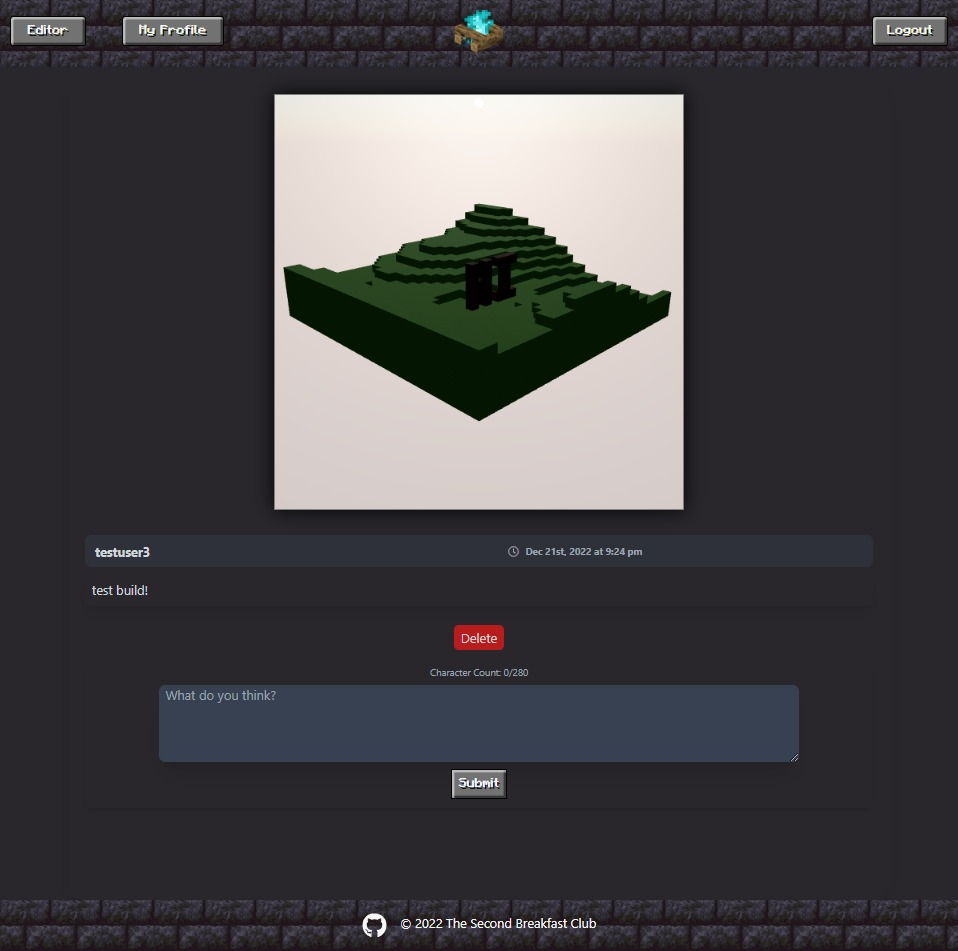

<h2 align="center">
  CHUNK'D 
  <a href="https://chunkd-aj.herokuapp.com/" target="_blank">CHUNK'D</a>
</h2>

This project was bootstrapped with [Create React App].

## Table of Contents:

- [Description](#Description)
- [Installation](#installation)
- [Usage](#usage)
- [Contributing](#Contributing)
- [Tests](#Tests)
- [License](#License)
- [Questions?](#questions)

## Description

A MERN Stack application that allows a user to play and create in a 3D environment and share their builds to a community of other creators. Users are able to add friends and can comment and hold discussions about the game and their builds that they have shared.

## Installation

First clone this repo to your local directory and install dependencies by running:

### `npm i`

In the project directory, you can run:

### `npm run dev`

Runs the app in the development mode.\
Open [http://localhost:3000](http://localhost:3000) to view it in your browser.

The page will reload when you make changes.

## Usage

You may also view the project [HERE](https://chunkd-aj.herokuapp.com/)

As a new user, you need to sign up to create an account to log in. Once logged in, you may view posts with builds shared by other users, comment on those posts, and add the other users as friends. You may also enter the editor where you can view the controls needed to create your own build by placing and destroying blocks. Once in the editor, you can save a 3-D rendering of your build that you can then add to your own posts to share for other users to view and comment on.

## Technologies Used

This project was built using these technologies.

- Three.js
- React Three fiber
- Noise.js
- JWT
- MongoDB
- Express.js
- React.js
- Node.js
- TailwindCss
- CSS3
- JS

## Features

**📖 Multi-Page Layout**

**🎨 Styled with Tailwind CSS**

**📱 Fully Responsive**

## Contributors

Adrian Jimenez, Alexander Havers, Caleb Funderburk, Austin Reed, Dane Cronin

## License

MIT License

For more information go to: [MIT License](https://choosealicense.com/licenses/mit/)

## Questions?

_For any questions, please contact us through the information below:_

GitHub:
[Adrian Jimenez](https://github.com/PuppetAJ)
[Alexander Havers](https://github.com/pseudoDjnn)
[Caleb Funderburk](https://github.com/CalebFunderburk)
[Austin Reed](https://github.com/AReed98)
[DaneCronin](https://github.com/DaneCronin)

Link to repo on [GitHub](https://github.com/PuppetAJ/ReactMC)
